<h2>I'm an AI Engineer in training and a BCA student specializing in Artificial Intelligence & Data Science. 
 I love collaborating on AI, Python, and Software Development projects. 
 Currently diving deep into machine learning, AI Research, and data science tools. 
<h2>AI Engineer and Software Developer</h2>

<h2> Languages and Tools I Use</h2>

<h2> Where to find me</h2>

